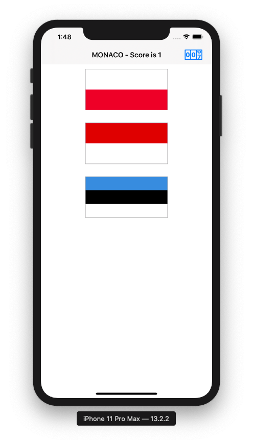
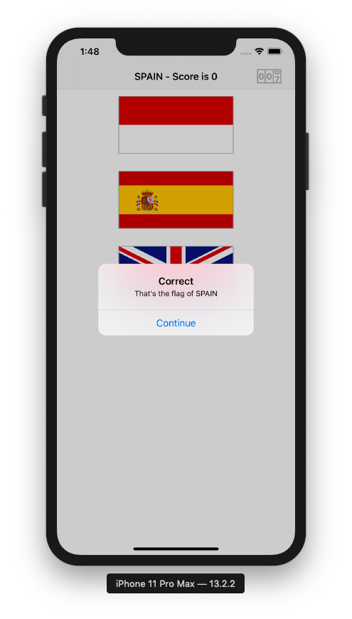
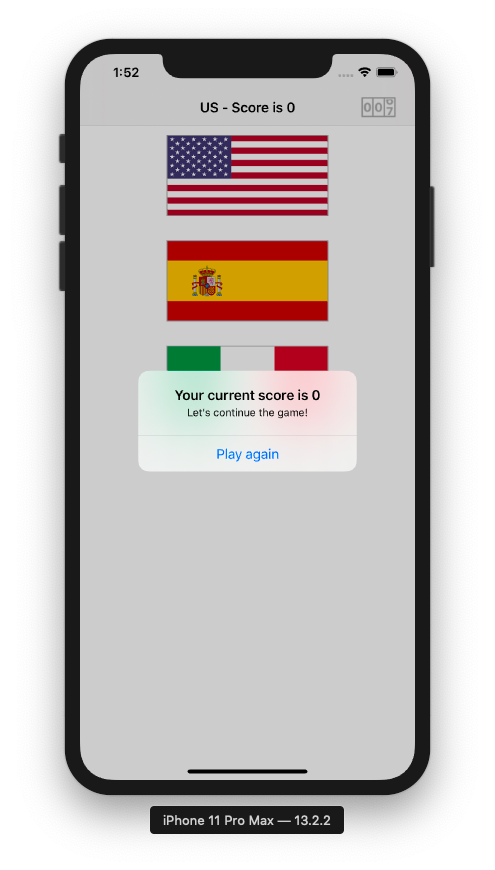
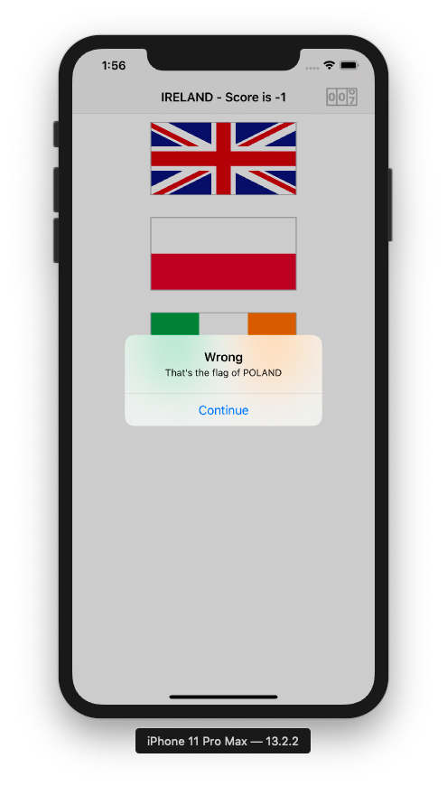
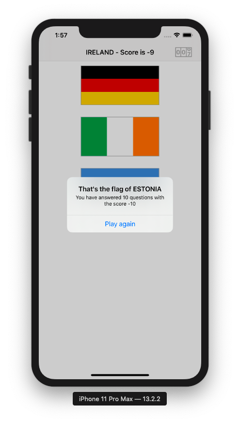

# FlagGame_Swift_iOS

This is my solution to the challenges from a Hacking with Swift tutorial (a project with a flag game)&
This game can keep track of the score, shows alert containing the current score, shows an alert containing the final score and a function starting the game again.

